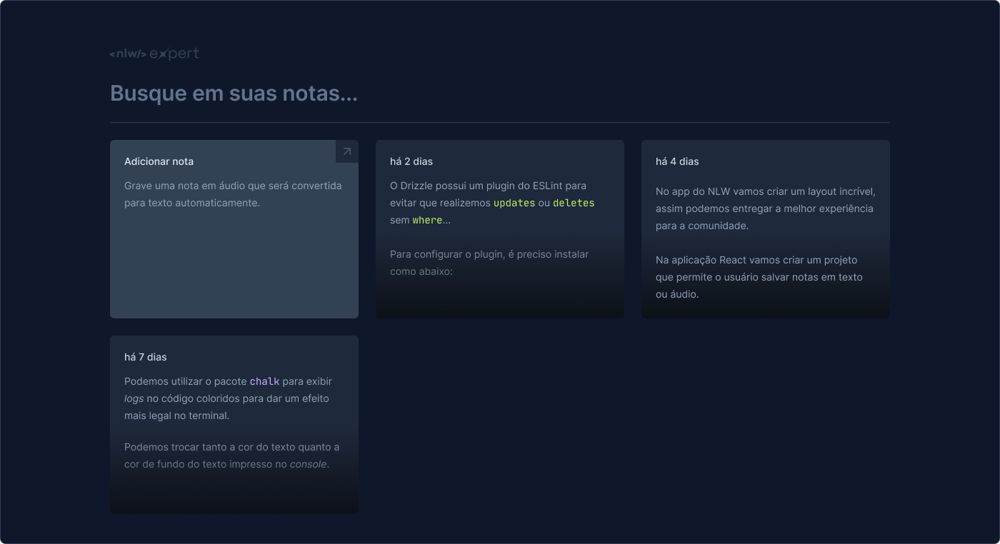

# Trilha ReactJS - Aplicativo Notes
### React + TypeScript + Vite + TailwindCSS

Aplicativo de notas front-end, podendo ser **digitado** ou utilizada a função **"Voz para texto"** e possibilidade de busca de conteudo nas notas.

.png)
.png)

---

## Tecnologias utilizadas
###  [React](https://react.dev/)
###  [ViteJS](https://vitejs.dev/)
###  [TypeScript](https://www.typescriptlang.org/)
###  [TailwindCSS](https://tailwindcss.com/)

 

## Bibliotecas
- [RadixUI](https://www.radix-ui.com/)
- [Date-fbs](https://date-fns.org/)
- [Lucile](https://lucide.dev/)
- [Sonner](https://sonner.emilkowal.ski/)

 

## Aulas em vídeo
- [Aula 01](https://www.youtube.com/watch?v=oHRhNas5MtY)
- [Aula 02](https://www.youtube.com/watch?v=8TydWjnb0_s)
-  [Aula 03]()